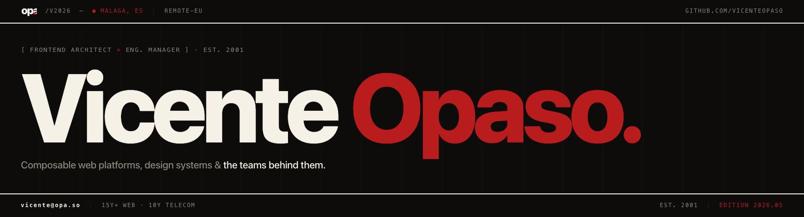

&nbsp;

I'm a **Web Engineering Manager**, **Frontend Architect**, and **Technical Leader** with over 25 years of experience building scalable, user-centered digital platforms. I specialize in modern **Frontend Architecture**, **Design Systems**, **Developer Experience (DevEx)**, and **AI-Native Engineering** — and I thrive at the intersection of engineering execution and strategic impact.

Most recently at **Nexthink**, I led a distributed Web Engineering team responsible for [nexthink.com](https://nexthink.com/), shaping a composable web platform to support global brand, marketing, and product strategy across 6 locales. My role blended **cross-functional leadership**, **technical governance**, and **continuous improvement** — including CI/CD automation via GitHub Actions and CodeQL, AI-augmented development workflows, and spec-driven engineering practices that raised Core Web Vitals by 25%.

At **EUROCONTROL**, I directed frontend architecture and governance for safety-critical aviation systems, leading the NMUI microfrontend framework and EUROCONTROL Design System (EDS) — reducing deployment friction by 40% through CI/CD modernization. At **Carlsberg Group**, I architected the [Malty Design System](https://github.com/carlsberg/malty) (React + TypeScript), founded the company's first Frontend Community of Practice, and owned frontend architecture for platforms supporting over €1B in annual B2B revenue.

Outside of work, I build live systems. You can read about them at [opa.so](https://opa.so/) or explore the source code for my personal site — built spec-first using Spec-Driven Development — on [GitHub](https://github.com/vicenteopaso/vicenteopaso-vibecode/).

&nbsp;

## Core Competencies

- **Frontend Architecture & Composable Platforms**  
  Designing scalable, maintainable systems aligned with brand and business goals.

- **Design Systems & Accessibility**  
  Architecting inclusive, enterprise-grade UI libraries for global adoption (WCAG 2.1).

- **Developer Experience (DevEx) & CI/CD Automation**  
  Enhancing productivity through automation, governance, documentation, and AI-assisted tooling.

- **Engineering Leadership & Distributed Teams**  
  Building high-performing teams that collaborate effectively across disciplines and time zones.

- **Community & Culture Building**  
  Fostering knowledge-sharing, mentorship, and shared ownership through CoPs and internal leadership initiatives.

- **AI-Native Engineering & Agentic Workflows**  
  Spec-Driven Development (SDD), MCP server architecture, AI guardrails, and self-correcting agentic pipelines. Hands-on experience running open-source models (Qwen 2.5 Coder) on cloud GPU infrastructure (Modal), with a multi-provider abstraction layer supporting Claude, OpenAI, and any OpenAI-compatible endpoint.

&nbsp;

## Professional Highlights

- **Nexthink | Manager of Web Engineering**  
  Led the architecture and delivery of [nexthink.com](https://nexthink.com/), a composable platform built with Next.js, GraphQL, Tailwind CSS, and Hygraph CMS — deployed via Vercel and governed through GitHub Actions, CodeQL, and branch protections. Delivered multilingual releases across 6 locales, raising Core Web Vitals by 25% and establishing a DevEx-first engineering culture.

- **EUROCONTROL | Technical Application Owner**  
  Directed frontend governance and modernization for mission-critical aviation systems. Led the NMUI microfrontend framework and the EUROCONTROL Design System (EDS), reducing deployment friction by 40% through CI/CD automation and structured engineering workflows.

- **Carlsberg Group | Frontend Solutions Architect & Design System Lead**  
  Architected B2B and marketing platforms supporting over €1B in annual turnover. Led the [Malty Design System](https://github.com/carlsberg/malty) (React + TypeScript, inner-sourcing model, npm distribution, GitHub Actions CI/CD) and founded the company's first Frontend Community of Practice to scale standards and collaboration across 30+ global markets.

- **Greygoo Media | Co-Founder & Technical Director**  
  Delivered full-stack web and mobile solutions for clients including GM, NCAA partners, and the Paulson Institute — leading strategy, architecture, and execution across an 8-year run.

&nbsp;

## What I Build

Outside of work, I build live systems — not side projects I started and abandoned, but production infrastructure I run, maintain, and improve. They're where I practice what I write about: AI-native engineering, self-hosted infrastructure, and product thinking end to end.

- **[opa.so](https://opa.so/)** — Personal site built spec-first using **Spec-Driven Development (SDD)**: a machine-readable `sdd.yaml`, a Constitution with eleven immutable invariants, and ADRs for every architectural decision. Every PR — human or AI — passes a ten-gate CI pipeline: ESLint, TypeScript, Vitest (90% coverage thresholds), Playwright E2E and visual regression, CodeQL, dependency audit, and Lighthouse CI (Performance ≥90, Accessibility ≥90, SEO ≥95). Bilingual EN/ES throughout.  
  → [GitHub](https://github.com/vicenteopaso/vicenteopaso-vibecode) · [Technical Governance](https://opa.so/en/technical-governance)

- **Dev Team** — A self-correcting autonomous delivery pipeline where specialized AI roles (PO → Designer → Backend → Frontend → QA → Fixer) carry a feature request through to a green CI pull request with no human intervention in the happy path. Runs **Qwen 2.5 Coder** on **Modal cloud GPUs**. A multi-provider abstraction layer makes the system fully configurable — switch between Qwen, Claude, OpenAI, or any OpenAI-compatible endpoint at runtime. Exposes the full pipeline as an MCP server (`submit_task`, `get_status`, `resume_task`) so any MCP-compatible client can fire a task and walk away.

- **Political Sentiment Index** — A scheduled pipeline running every six hours that ingests 70+ news sources, deduplicates and enriches articles, then uses an LLM to score anxiety across 9 political domains. Pre-computed VADER sentiment signals reduce LLM token usage by an estimated 60–70%. Production-grade: atomic DB transactions, SSRF protection, HMAC-authenticated internal endpoints, idempotent pipeline design, and a full audit trail in PostgreSQL.

- **AI Job Search Pipeline** — End-to-end job-discovery pipeline with multi-source ingestion (11 job boards + email relay), Claude-powered match scoring with dealbreaker detection, and application tracking in Linear. An MCP server lets Claude query and act on the pipeline directly — treating job search as an agentic workflow rather than a spreadsheet. 660+ opportunities ingested, scored, and tracked through a full application lifecycle.

- **Self-Hosted Cloud Platform** — VPS running Nextcloud and Immich with defense-in-depth security (drop-all container capabilities, fail2ban, HSTS, OCSP stapling, modern TLS), automated daily backups to Wasabi S3, and a Python deduplication pipeline running on systemd timers.

&nbsp;

## Key Achievements

- **Verified Performance Outcomes**  
  Core Web Vitals +25% across 6 markets (Nexthink); deployment friction −40% (EUROCONTROL).

- **Design System at Scale**  
  Built and scaled enterprise-grade design systems — Malty (Carlsberg) and EDS (EUROCONTROL) — with governance models, inner-sourcing contribution frameworks, and multi-market adoption.

- **AI-Native Pipeline Architecture**  
  Designed and shipped a self-correcting agentic delivery pipeline running open-source models on cloud GPU infrastructure, with a multi-provider abstraction layer and MCP server interface.

- **Engineering Culture Enablement**  
  Founded and led Communities of Practice at Carlsberg Group, scaling engineering standards and collaboration across 30+ global markets.

- **Spec-Driven Development (SDD)**  
  Pioneered and published a governance-first framework for AI-assisted engineering — in production use on opa.so and documented publicly.

&nbsp;

## Languages

- **Spanish**: Native
- **English**: Bilingual (C2)

&nbsp;

## Testimonials

> Vicente played a key role in shaping the technical direction of both the NMUI framework and the Eurocontrol Design System (EDS)... His work had a noticeable impact on the stability and scalability of our systems, and I appreciated his pragmatic, steady approach to solving technical challenges.
>
> — ***[Razvan Margauan](https://www.linkedin.com/in/razvan-mihai-margauan/) | iNM Programme Director @ [EUROCONTROL](https://eurocontrol.int/)***

&nbsp;

> Vicente's technical expertise in JavaScript, TypeScript, React, and Frontend technologies, combined with his leadership in establishing a Community of Practice, has greatly improved the developer experience and code quality across the organization. Vicente's contributions were instrumental in driving our e-commerce growth to over €1 billion annually.
>
> — ***[Peter Birkholm-Buch](https://www.linkedin.com/in/peterbirkholmbuch/) | Director of Software Engineering in Growth Products & Data @ [Carlsberg Group](https://carlsberggroup.com/)***

&nbsp;

---

### Let's Connect

[opa.so](https://opa.so/) · [LinkedIn](https://linkedin.com/in/vicenteopaso/) · [X](https://x.com/vicenteopaso/)
